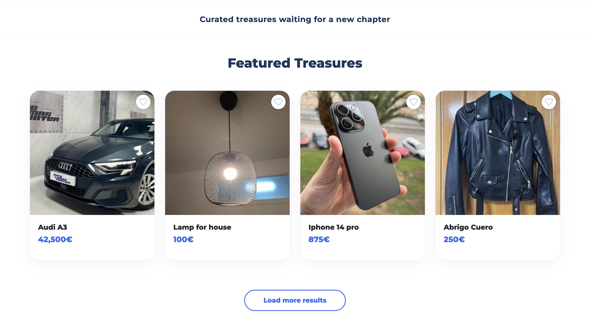
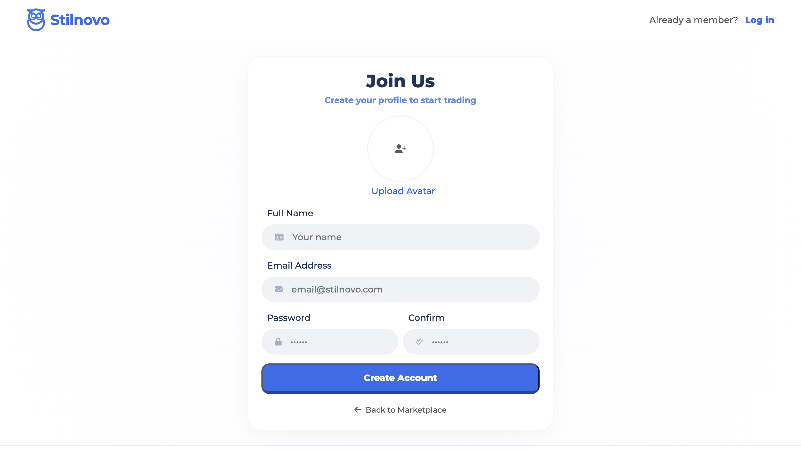
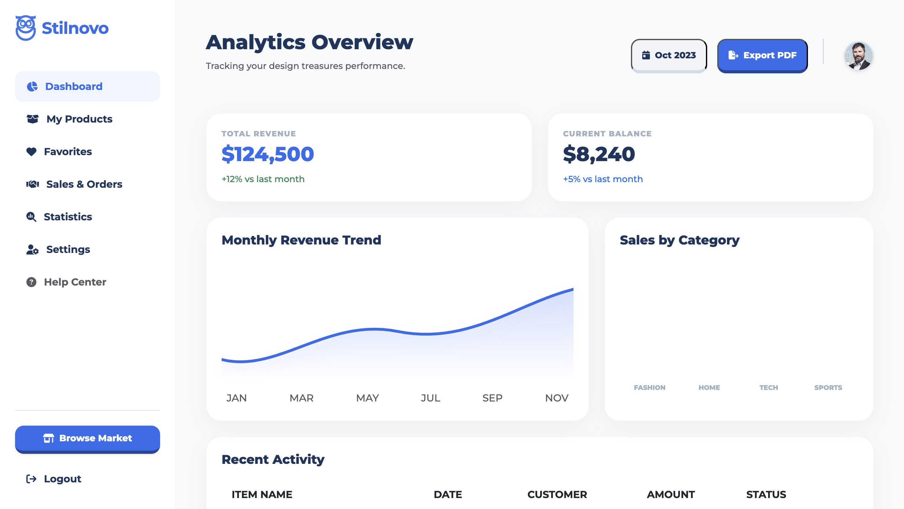
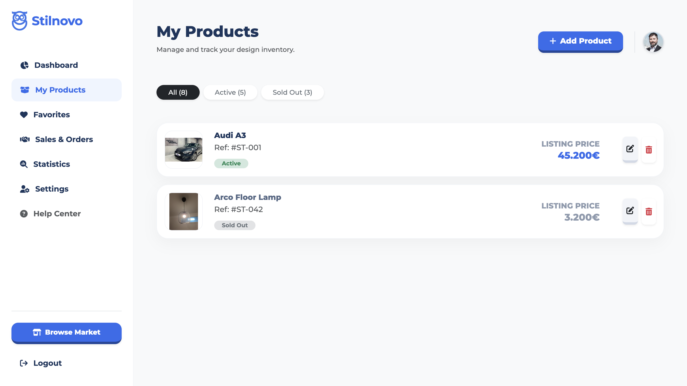
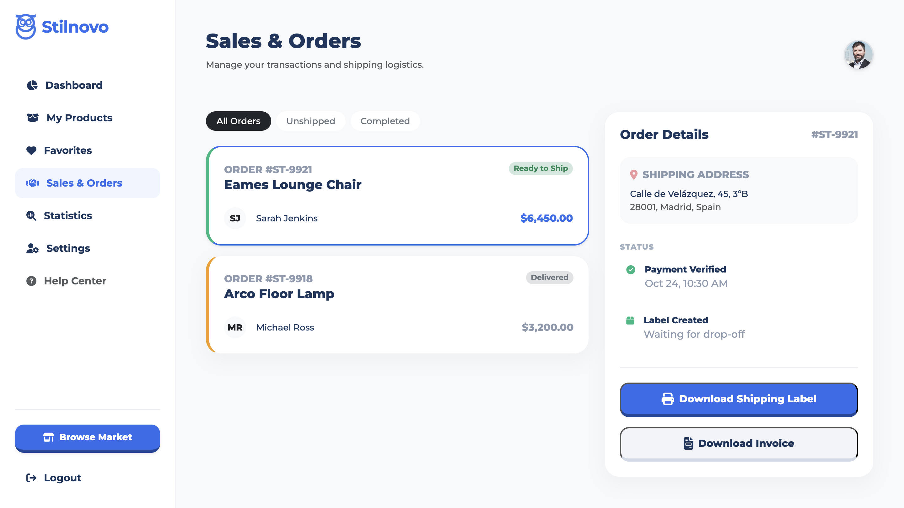
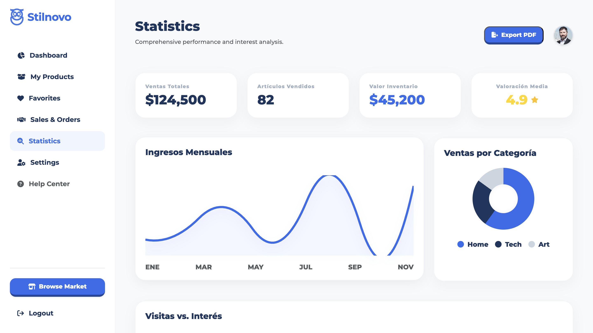
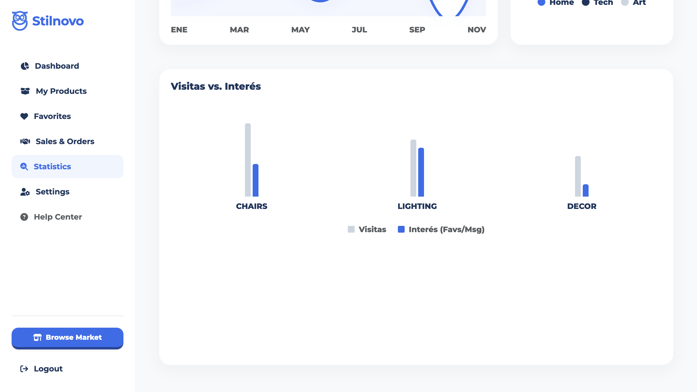
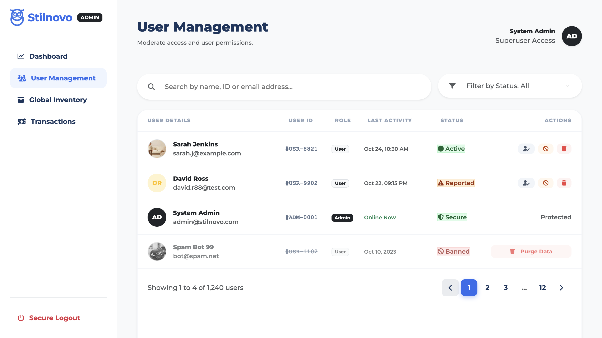
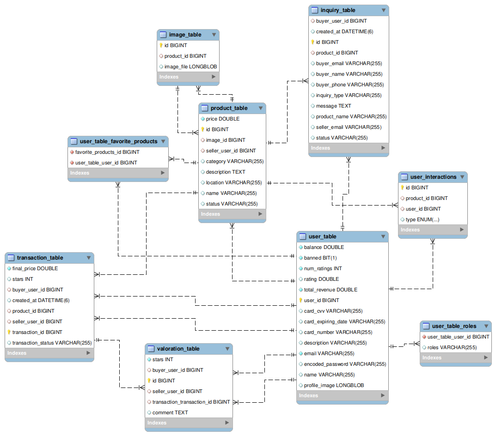
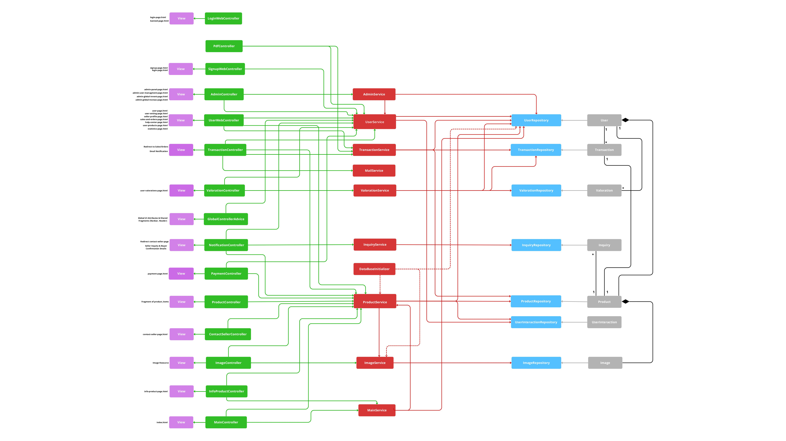

# Stilnovo.es

## 👥 Miembros del Equipo
| Nombre y Apellidos | Correo URJC | Usuario GitHub |
|:--- |:--- |:--- |
| Gabriele Antonio Ricucci | ga.ricucci.2025@alumnos.urjc.es | @gabrieleri |
| Victor Hugo Oliveira Petroceli | vh.deoliveira.2023@alumnos.urjc.es | @CodVictor |
| Raúl Tejada Merinero | r.tejada.2023@alumnos.urjc.es | @raultejada24 |
| Ariel Rodríguez Lozano | a.rodriguezl.2023@alumnos.urjc.es | @Ariel1725 |
| Alonso Gutierrez Sánchez | a.gutierrez.2023@alumnos.urjc.es | @Alon345 |

---

## 🎭 **Preparación 1: Definición del Proyecto**

### **Descripción del Tema**
Stilnovo es una plataforma de compra/venta de objetos usados enfocada en dar un "nuevo estilo" a artículos de segunda mano. La aplicación permite a los usuarios publicar anuncios, gestionar transacciones seguras y fomentar la economía circular a través de un mercado digital estético y funcional.

### **Entidades**
Indicar las entidades principales que gestionará la aplicación y las relaciones entre ellas:

1. **Usuario**: Almacena información personal, roles, avatar y Balance Económico actual.
2. **Producto**: Artículos para la venta con descripción, precio, categoría y fotos.
3. **Transacción**: Registra el proceso de compra vinculando a un comprador, un vendedor y un producto.
4. **Valoración**: Sistema de feedback con comentario y puntuación tras una transacción.

**Relaciones entre entidades:**
- Usuario - Producto: Un usuario puede publicar múltiples productos (propietario). Relación 1:N.
- Transacción - Usuario/Producto: Una transacción vincula obligatoriamente a un comprador, un vendedor y un único artículo vendido.
- Valoración - Transacción: Cada valoración está asociada a una transacción completada. Relación 1:1.
- Producto - Categoría: Los productos se agrupan por categorías para facilitar la búsqueda.

### **Permisos de los Usuarios**
Describir los permisos de cada tipo de usuario e indicar de qué entidades es dueño:

* **Usuario Anónimo**: 
  - Permisos: Navegar por la web, consultar el catálogo de productos y utilizar el buscador. Solo consulta información pública.
  - No es dueño de ninguna entidad

* **Usuario Registrado**: 
  - Permisos: Publicar artículos con fotos, realizar compras, acceder a su historial detallado de sus compras y ventas, gestionar su perfil con avatar, gestionar su inventario, editar/borrar artículos subidos, visualización de analíticas (puntuación del vendedor, ingresos, distribución por categorias, etc) y generación de PDFs (facturas y datos analíticos), Digital Seller Card con código QR (para la verificación de identidad en encuentros físicos) entre otros.
  - Es dueño de: Sus propios productos publicados, su perfil de usuario y las valoraciones que emita.

* **Administrador**: 
  - Permisos: Control total sobre la información. Puede moderar contenido, eliminar productos que infrinjan normas o banear usuarios.
  - Es dueño de: Gestiona todas las entidades de la plataforma.

### **Imágenes**
Indicar qué entidades tendrán asociadas una o varias imágenes:

- **Usuario**: Una imagen de avatar personalizada.
- **Producto**: Múltiples fotos descriptivas por cada artículo anunciado.

### **Gráficos**
Para ofrecer una experiencia de gestión basada en datos, la aplicación integra visualizaciones dinámicas que permiten al usuario y al administrador monitorizar el rendimiento comercial en tiempo real.

- **Gráfico 1**: Distribución de Ventas por Categoría (Donut Chart): Ubicado en el Dashboard de usuario, este gráfico representa proporcionalmente el éxito de ventas en las categorías de Home, Tech, Art y Cars.
- **Gráfico 2**: Evolución de Ingresos Mensuales (Line Chart): Visualización temporal que muestra la tendencia de ingresos del usuario a lo largo del año (user-statistics.jpg), facilitando la identificación de picos de demanda.
- **Gráfico 3**: Análisis de Visitas vs. Interés (Bar Chart): Gráfico de barras comparativo que mide el tráfico recibido frente a las interacciones reales (favoritos/compra) por cada tipo de producto.
  
### **Tecnología Complementaria**
Se han seleccionado tecnologías que extienden las capacidades básicas de la web para simular un entorno de producción real.

- **Generación de PDFs**: Implementación de una librería para la creación automática de facturas y recibos de compra, descargables directamente desde el panel de órdenes, así como la generación de PDFs con las analíticas del usuario y de etiquetas de envío tras una transacción.
- **Envío de Correos (Mail Service)**: Integración de un servicio de mensajería para gestionar la comunicación inicial entre interesados. Al pulsar "Send Message", el sistema dispara un correo automático al vendedor con los detalles de la consulta del comprador.

### **Algoritmo o Consulta Avanzada**
El sistema no se limita a mostrar datos, sino que procesa la actividad del usuario para personalizar su experiencia de navegación.

- **Algoritmo/Consulta**: Sistema de Recomendaciones personalizado.
- **Descripción**: Muestra en la página de inicio "Productos que te pueden interesar" basándose en las categorías que el usuario ha comprado o visitado previamente.

---

## 🛠 **Preparación 2: Maquetación de páginas con HTML y CSS**

### **Vídeo de Demostración**
📹 **[Enlace al vídeo en YouTube](https://youtu.be/lXqGTZpMamk?si=9I0j98zrY1fShL06)**
> Vídeo mostrando las principales funcionalidades de la aplicación web.

### **Diagrama de Navegación**
Diagrama que muestra cómo se navega entre las diferentes páginas de la aplicación:


**Descripción del flujo de navegación:**  
Mapa visual que organiza la navegación por colores (Azul: Todos los Usuarios, Amarillo: Usuario Registrado, Verde: Administrador) y utiliza las miniaturas de las capturas de la siguiente sección como nodos del sistema.

### **Capturas de Pantalla y Descripción de Páginas**

#### **1. Página Principal / Home**


**Descripción:**
Punto de entrada principal que presenta la propuesta de valor y permite la navegación hacia el catálogo y los formularios de acceso.

#### **2. Catálogo Público (Featured Treasures) / Home**


**Descripción:**
Visualización de la entidad Producto con datos de ejemplo representativos, permitiendo al usuario anónimo consultar el stock disponible.

#### **3. Detalle de Producto**


**Descripción:**
Vista completa de la entidad con especificaciones técnicas, precio y acceso a la tecnología de contacto por email.

#### **4. Detalle Técnico y Motor de Recomendaciones**


**Descripción:**
Parte inferior de la ficha de producto que muestra las especificaciones y la descripción del vendedor. Destaca la sección "You may also like", que es la representación visual del Algoritmo Avanzado: el sistema consulta la base de datos para sugerir dinámicamente artículos de categorías afines o complementarias al producto actual.

#### **5. Interfaz de Autenticación**


**Descripción:**
Formulario de acceso gestionado por roles para discriminar entre el panel de usuario y el panel de administración.

#### **6. Registro de Usuarios**


**Descripción:**
Interfaz que permite la creación de nuevas cuentas en la base de datos para interactuar con el marketplace.

#### **Área Privada (Usuario Registrado)**

#### **7. Panel de Actividad (Analytics Overview)**


**Descripción:**
Vista personalizada que utiliza gráficos para monitorizar los ingresos y las ventas del usuario.

#### **8. Gestión de Inventario Propio**


**Descripción:**
Listado de la entidad Producto donde el dueño puede visualizar sus anuncios y acceder a las opciones de borrado o edición.

#### **9. Formulario de Publicación**


**Descripción:**
Interfaz para la creación de nuevos elementos en la base de datos, incluyendo la subida de imágenes.

#### **10. Formulario de Edición**


**Descripción:**
Interfaz para la edición de elementos en la base de datos, incluyendo la cambio de imágenes.

#### **11. Productos Favoritos**


**Descripción:**
Listado de la entidad Producto donde el dueño podrá visualizar productos agregados como "Favoritos".

#### **12. Historial de Transacciones**


**Descripción:**
Registro de compras y ventas que integra la Tecnología Complementaria de generación de facturas en PDF.


#### **13. Análisis de Datos G1 y G2**


**Descripción:**
Implementación de gráficos de líneas y tarta para visualizar la evolución de ingresos y ventas por categoría.

#### **14. Gráfico de Interés G3**


**Descripción:**
Gráfico de barras avanzado que compara visitas frente a interacciones reales por categoría de producto.

#### **15. Perfil y Verificación**


**Descripción:**
Gestión de datos personales y visualización de la Digital Seller Card para transacciones seguras.

#### **Administrador**
#### **16. Monitor Global de la Plataforma**


**Descripción:**
Dashboard exclusivo con KPIs de sistema, usuarios reportados y volumen total de anuncios.

#### **17. Gestión de Usuarios**


**Descripción:**
Herramienta de moderación que permite al administrador realizar acciones de baneo o purga de datos sobre cualquier perfil.

#### **18. Inventario Global**


**Descripción:**
Registro maestro de todos los productos del marketplace, con permisos para editar o eliminar cualquier anuncio fraudulento.

#### **19. Auditoría Financiera**


**Descripción:**
Vista de la entidad Transacción a nivel global para gestionar disputas y reembolsos.

---

## 🛠 **Práctica 1: Web con HTML generado en servidor y AJAX**

### **Vídeo de Demostración**
📹 **[Enlace al vídeo en YouTube](https://www.youtube.com/watch?v=x91MPoITQ3I)**
> Vídeo mostrando las principales funcionalidades de la aplicación web.

### **Navegación y Capturas de Pantalla**

#### **Diagrama de Navegación**

Solo si ha cambiado.

#### **Capturas de Pantalla Actualizadas**

Solo si han cambiado.

### **Instrucciones de Ejecución**

#### **Requisitos Previos**
- **Java**: versión 21 o superior
- **Maven**: versión 3.8 o superior
- **MySQL**: versión 8.0 o superior
- **Git**: para clonar el repositorio

#### **Pasos para ejecutar la aplicación**

1. **Clonar el repositorio**  
   Crea una carpeta para el proyecto, accede a ella y clona el repositorio:

   ```bash
   git clone https://github.com/CodeURJC-DAW-2025-26/practica-daw-2025-26-grupo-5.git
   cd practica-daw-2025-26/practica-daw-2025-26-grupo-5
   ```

2. **Acceder al directorio del backend**  
   Entra en la carpeta que contiene la lógica del servidor:

   ```bash
   cd backend
   ```

3. **Levantar la base de datos**  
   Asegúrate de tener abierto Docker Desktop (o cualquier otro motor de Docker) y ejecuta el script para inicializar la base de datos:

   ```bash
   ./start_db.sh
   ```

   **Nota:** Espera unos segundos tras ejecutar el script para asegurar que la base de datos se ha creado y configurado correctamente antes del siguiente paso.

4. **Ejecutar la aplicación**  
   Localiza el archivo principal del proyecto en tu IDE (IntelliJ, VS Code, etc.):

   `src/main/java/es/stilnovo/library/Application.java`

5. **Acceso a la web**  
   Una vez que la aplicación esté en marcha, abre tu navegador y accede a:

   ```bash
   https://localhost:8443
   ```

Solo un recordatorio: como la aplicación usa HTTPS en el puerto 8443, la primera vez que entres el navegador te dará un aviso de "Conexión no privada" (por el certificado auto-firmado de desarrollo). Solo tienes que darle a **"Configuración avanzada"** y **"Acceder a localhost (sitio no seguro)"** para entrar.
#### **Credenciales de prueba**
- **Usuario Admin**: usuario: `admin`, contraseña: `admin`
- **Usuario Registrado**: usuario: `user`, contraseña: `user`

### **Diagrama de Entidades de Base de Datos**

Diagrama mostrando las entidades, sus campos y relaciones:



> **Descripción del Diagrama:**
> 
> El diagrama EER generado desde MySQL Workbench muestra las tablas principales y las auxiliares creadas por Hibernate:
> 
> - **Tablas principales:** `user_table`, `product_table`, `transaction_table`, `image_table`, `inquiry_table`, `user_interactions`, `valoration_table`.
> - **Tablas auxiliares:** `user_table_favorite_products` (favoritos, relación N:M) y `user_table_roles` (roles por usuario).
> 
> **Relaciones clave (según el diagrama):**
> - `user_table` **1:N** `product_table` (seller_user_id)
> - `product_table` **1:1** `image_table` (image_id)
> - `transaction_table` **N:1** `user_table` (buyer_user_id y seller_user_id)
> - `transaction_table` **1:1** `product_table` (product_id)
> - `inquiry_table` **N:1** `user_table` (buyer_user_id) y **N:1** `product_table` (product_id)
> - `user_interactions` **N:1** `user_table` y **N:1** `product_table`
> - `valoration_table` **N:1** `user_table` (buyer_user_id y seller_user_id) y **N:1** `transaction_table`

### **Diagrama de Clases y Templates**

Diagrama de clases de la aplicación con diferenciación por colores o secciones:



> Este diagrama detalla la arquitectura lógica de **Stilnovo**, estructurada en un modelo de capas que garantiza la separación de responsabilidades y la escalabilidad del sistema.
> 
> **Organización de Componentes:**
> * **Vistas (Morado):** Capa de presentación que gestiona la interfaz de usuario, integrando tanto páginas completas como fragmentos HTML dinámicos para una experiencia fluida.
> * **Controladores (Verde):** Encargados de interceptar las peticiones del cliente, coordinar el flujo de navegación y delegar la ejecución de reglas de negocio.
> * **Servicios (Rojo):** Núcleo de la aplicación donde se procesa la lógica de negocio. Centraliza funciones complejas como el cálculo de inventarios, el enfriamiento de notificaciones y la integración con servicios de infraestructura (Email y PDF).
> * **Repositorios (Azul):** Capa de persistencia que utiliza Spring Data JPA para abstraer y gestionar el acceso a los datos de forma eficiente.
> * **Entidades/Modelos (Gris):** Representación de los objetos de dominio, definiendo las reglas de integridad y las relaciones de composición esenciales para el negocio (User, Product, Transaction, etc.).
> 
> **Principios de Diseño:**
> El diagrama refleja un flujo de dependencias unidireccional (Controlador → Servicio → Repositorio), minimizando el acoplamiento y permitiendo que la lógica de negocio sea independiente de la tecnología de persistencia o de la interfaz de usuario.

### **Participación de Miembros en la Práctica 1**

#### **Alumno 1 - Victor Hugo Oliveira Petroceli**

Responsable del desarrollo de la arquitectura backend y de la lógica de negocio en las áreas de valoraciones, transacciones, productos y usuario. He implementado el flujo completo de transacciones P2P, el sistema de valoraciones, la seguridad mediante Spring Security y el ciclo de vida integral de los productos . Además, he gestionado la integración de imágenes y la optimización de la persistencia de datos y relaciones complejas entre entidades en la base de datos.

| Nº | Commits | Files |
|:------------: |:------------:| :------------:|
|1| [feat: implement full p2p transaction flow, user ratings, and profile settings](https://github.com/CodeURJC-DAW-2025-26/practica-daw-2025-26-grupo-5/commit/0e7534c90c98f684d3dfa4065fc83d454309ab15) | [UserWebController](https://github.com/CodeURJC-DAW-2025-26/practica-daw-2025-26-grupo-5/blob/main/backend/src/main/java/es/stilnovo/library/controller/UserWebController.java) |
|2| [refactor: major security overhaul, service-layer migration, and UI fixes](https://github.com/CodeURJC-DAW-2025-26/practica-daw-2025-26-grupo-5/commit/4a93d87216e616314c06cf6c1e8f7e82644c6972) | [UserService](https://github.com/CodeURJC-DAW-2025-26/practica-daw-2025-26-grupo-5/blob/main/backend/src/main/java/es/stilnovo/library/service/UserService.java) |
|3| [Product editing and adding implemented with search and categories](https://github.com/CodeURJC-DAW-2025-26/practica-daw-2025-26-grupo-5/commit/cec4e04d380abd3adf90684a2d8390aec0b11a61) | [ProductService](https://github.com/CodeURJC-DAW-2025-26/practica-daw-2025-26-grupo-5/blob/main/backend/src/main/java/es/stilnovo/library/service/ProductService.java) |
|4| [Signup working](https://github.com/CodeURJC-DAW-2025-26/practica-daw-2025-26-grupo-5/commit/967380ebc229fc60ffbfb0b15d48551f6842120f) | [ValorationService](https://github.com/CodeURJC-DAW-2025-26/practica-daw-2025-26-grupo-5/blob/main/backend/src/main/java/es/stilnovo/library/service/ValorationService.java) |
|5| [feat(admin): implement global transactions page and secure deletion logic](https://github.com/CodeURJC-DAW-2025-26/practica-daw-2025-26-grupo-5/commit/adf056929cc3494bd094cb1659b6812c7e9b7933) | [TransactionService](https://github.com/CodeURJC-DAW-2025-26/practica-daw-2025-26-grupo-5/blob/main/backend/src/main/java/es/stilnovo/library/service/TransactionService.java) |

---

#### **Alumno 2 - Alonso Gutiérrez Sánchez**

Responsable de el botón de load-more gestionado mediante un archivo JavaScript AJAX y de la creación de los gráficos de distribución de ventas por categoría (Donut Chart), el de evolución de ingresos mensuales (Line Chart) y el de análisis de visitas contra interés (Bar Chart).

| Nº    | Commits      | Files      |
|:------------: |:------------:| :------------:|
|1| [Descripción commit 1](URL_commit_1)  | [Archivo1](URL_archivo_1)   |
|2| [Descripción commit 2](URL_commit_2)  | [Archivo2](URL_archivo_2)   |
|3| [Descripción commit 3](URL_commit_3)  | [Archivo3](URL_archivo_3)   |
|4| [Descripción commit 4](URL_commit_4)  | [Archivo4](URL_archivo_4)   |
|5| [Descripción commit 5](URL_commit_5)  | [Archivo5](URL_archivo_5)   |

---

#### **Alumno 3 - Raúl Tejada Merinero**

Responsable de implementar la generación automática de 3 tipos de documentos PDF (factura de compra, recibo de transacción e invoice del vendedor), integrando la librería iText para crear reportes profesionales. Además, he desarrollado un sistema completo de notificaciones por email con 4 templates dinámicos (confirmación de compra, mensaje de comprador, notificación de venta al vendedor, y confirmación de mensaje enviado), utilizando JavaMailSender y SMTP. He optimizado la comunicación usuario-plataforma mediante plantillas de email HTML personalizadas y he asegurado la correcta persistencia y envío de datos críticos en el flujo de transacciones.

| Nº    | Commits      | Files      |
|:------------: |:------------:| :------------:|
|1| [Emails + PDF (done)](https://github.com/CodeURJC-DAW-2025-26/practica-daw-2025-26-grupo-5/commit/5f3356464863ce14510d26b7efcc098f5d8d865b) | [MainController.java](https://github.com/CodeURJC-DAW-2025-26/practica-daw-2025-26-grupo-5/blob/main/backend/src/main/java/es/stilnovo/library/controller/MainController.java) |
|2| [Pdf Download done](https://github.com/CodeURJC-DAW-2025-26/practica-daw-2025-26-grupo-5/commit/c22f5e6afb6de1453584c667cf57f9a5070f071b)  | [UserWebController.java](https://github.com/CodeURJC-DAW-2025-26/practica-daw-2025-26-grupo-5/blob/main/backend/src/main/java/es/stilnovo/library/controller/UserWebController.java)   |
|3| [fix secure URLs from pdfs](https://github.com/CodeURJC-DAW-2025-26/practica-daw-2025-26-grupo-5/commit/953dd321c9ae1a4928028e6783aa541a5930bc54)  | [UserService.java](https://github.com/CodeURJC-DAW-2025-26/practica-daw-2025-26-grupo-5/blob/main/backend/src/main/java/es/stilnovo/library/service/UserService.java) |
|4| [Fix inquiry emails](https://github.com/CodeURJC-DAW-2025-26/practica-daw-2025-26-grupo-5/commit/6ee1d8db98149cba096ff2b8dd7b30bd74d99a8c)  | [AdminController.java](https://github.com/CodeURJC-DAW-2025-26/practica-daw-2025-26-grupo-5/blob/main/backend/src/main/java/es/stilnovo/library/controller/AdminController.java)  |
|5| [New Bought Email Update](https://github.com/CodeURJC-DAW-2025-26/practica-daw-2025-26-grupo-5/commit/b2c72482cc49939da5b4f9af6dfe4caec7c03348)  | [ProductService.java](https://github.com/CodeURJC-DAW-2025-26/practica-daw-2025-26-grupo-5/blob/main/backend/src/main/java/es/stilnovo/library/service/ProductService.java)   |

---

#### **Alumno 4 - [Nombre Completo]**

[Descripción de las tareas y responsabilidades principales del alumno en el proyecto]

| Nº    | Commits      | Files      |
|:------------: |:------------:| :------------:|
|1| [Descripción commit 1](URL_commit_1)  | [Archivo1](URL_archivo_1)   |
|2| [Descripción commit 2](URL_commit_2)  | [Archivo2](URL_archivo_2)   |
|3| [Descripción commit 3](URL_commit_3)  | [Archivo3](URL_archivo_3)   |
|4| [Descripción commit 4](URL_commit_4)  | [Archivo4](URL_archivo_4)   |
|5| [Descripción commit 5](URL_commit_5)  | [Archivo5](URL_archivo_5)   |

---

## 🛠 **Práctica 2: Incorporación de una API REST a la aplicación web, despliegue con Docker y despliegue remoto**

### **Vídeo de Demostración**
📹 **[Enlace al vídeo en YouTube](https://www.youtube.com/watch?v=x91MPoITQ3I)**
> Vídeo mostrando las principales funcionalidades de la aplicación web.

### **Documentación de la API REST**

#### **Especificación OpenAPI**
📄 **[Especificación OpenAPI (YAML)](/api-docs/api-docs.yaml)**

#### **Documentación HTML**
📖 **[Documentación API REST (HTML)](https://raw.githack.com/[usuario]/[repositorio]/main/api-docs/api-docs.html)**

> La documentación de la API REST se encuentra en la carpeta `/api-docs` del repositorio. Se ha generado automáticamente con SpringDoc a partir de las anotaciones en el código Java.

### **Diagrama de Clases y Templates Actualizado**

Diagrama actualizado incluyendo los @RestController y su relación con los @Service compartidos:


### **Instrucciones de Ejecución con Docker**

#### **Requisitos previos:**
- Docker instalado (versión 20.10 o superior)
- Docker Compose instalado (versión 2.0 o superior)

#### **Pasos para ejecutar con docker-compose:**

1. **Clonar el repositorio** (si no lo has hecho ya):
   ```bash
   git clone https://github.com/[usuario]/[repositorio].git
   cd [repositorio]
   ```

2. **AQUÍ LOS SIGUIENTES PASOS**:

### **Construcción de la Imagen Docker**

#### **Requisitos:**
- Docker instalado en el sistema

#### **Pasos para construir y publicar la imagen:**

1. **Navegar al directorio de Docker**:
   ```bash
   cd docker
   ```

2. **AQUÍ LOS SIGUIENTES PASOS**

### **Despliegue en Máquina Virtual**

#### **Requisitos:**
- Acceso a la máquina virtual (SSH)
- Clave privada para autenticación
- Conexión a la red correspondiente o VPN configurada

#### **Pasos para desplegar:**

1. **Conectar a la máquina virtual**:
   ```bash
   ssh -i [ruta/a/clave.key] [usuario]@[IP-o-dominio-VM]
   ```
   
   Ejemplo:
   ```bash
   ssh -i ssh-keys/app.key vmuser@10.100.139.XXX
   ```

2. **AQUÍ LOS SIGUIENTES PASOS**:

### **URL de la Aplicación Desplegada**

🌐 **URL de acceso**: `https://[nombre-app].etsii.urjc.es:8443`

#### **Credenciales de Usuarios de Ejemplo**

| Rol | Usuario | Contraseña |
|:---|:---|:---|
| Administrador | admin | admin123 |
| Usuario Registrado | user1 | user123 |
| Usuario Registrado | user2 | user123 |

### **Participación de Miembros en la Práctica 2**

#### **Alumno 1 - [Nombre Completo]**

[Descripción de las tareas y responsabilidades principales del alumno en el proyecto]

| Nº    | Commits      | Files      |
|:------------: |:------------:| :------------:|
|1| [Descripción commit 1](URL_commit_1)  | [Archivo1](URL_archivo_1)   |
|2| [Descripción commit 2](URL_commit_2)  | [Archivo2](URL_archivo_2)   |
|3| [Descripción commit 3](URL_commit_3)  | [Archivo3](URL_archivo_3)   |
|4| [Descripción commit 4](URL_commit_4)  | [Archivo4](URL_archivo_4)   |
|5| [Descripción commit 5](URL_commit_5)  | [Archivo5](URL_archivo_5)   |

---

#### **Alumno 2 - [Nombre Completo]**

[Descripción de las tareas y responsabilidades principales del alumno en el proyecto]

| Nº    | Commits      | Files      |
|:------------: |:------------:| :------------:|
|1| [Descripción commit 1](URL_commit_1)  | [Archivo1](URL_archivo_1)   |
|2| [Descripción commit 2](URL_commit_2)  | [Archivo2](URL_archivo_2)   |
|3| [Descripción commit 3](URL_commit_3)  | [Archivo3](URL_archivo_3)   |
|4| [Descripción commit 4](URL_commit_4)  | [Archivo4](URL_archivo_4)   |
|5| [Descripción commit 5](URL_commit_5)  | [Archivo5](URL_archivo_5)   |

---

#### **Alumno 3 - [Nombre Completo]**

[Descripción de las tareas y responsabilidades principales del alumno en el proyecto]

| Nº    | Commits      | Files      |
|:------------: |:------------:| :------------:|
|1| [Descripción commit 1](URL_commit_1)  | [Archivo1](URL_archivo_1)   |
|2| [Descripción commit 2](URL_commit_2)  | [Archivo2](URL_archivo_2)   |
|3| [Descripción commit 3](URL_commit_3)  | [Archivo3](URL_archivo_3)   |
|4| [Descripción commit 4](URL_commit_4)  | [Archivo4](URL_archivo_4)   |
|5| [Descripción commit 5](URL_commit_5)  | [Archivo5](URL_archivo_5)   |

---

#### **Alumno 4 - [Nombre Completo]**

[Descripción de las tareas y responsabilidades principales del alumno en el proyecto]

| Nº    | Commits      | Files      |
|:------------: |:------------:| :------------:|
|1| [Descripción commit 1](URL_commit_1)  | [Archivo1](URL_archivo_1)   |
|2| [Descripción commit 2](URL_commit_2)  | [Archivo2](URL_archivo_2)   |
|3| [Descripción commit 3](URL_commit_3)  | [Archivo3](URL_archivo_3)   |
|4| [Descripción commit 4](URL_commit_4)  | [Archivo4](URL_archivo_4)   |
|5| [Descripción commit 5](URL_commit_5)  | [Archivo5](URL_archivo_5)   |

---

## 🛠 **Práctica 3: Implementación de la web con arquitectura SPA**

### **Vídeo de Demostración**
📹 **[Enlace al vídeo en YouTube](URL_del_video)**
> Vídeo mostrando las principales funcionalidades de la aplicación web.

### **Preparación del Entorno de Desarrollo**

#### **Requisitos Previos**
- **Node.js**: versión 18.x o superior
- **npm**: versión 9.x o superior (se instala con Node.js)
- **Git**: para clonar el repositorio

#### **Pasos para configurar el entorno de desarrollo**

1. **Instalar Node.js y npm**
   
   Descarga e instala Node.js desde [https://nodejs.org/](https://nodejs.org/)
   
   Verifica la instalación:
   ```bash
   node --version
   npm --version
   ```

2. **Clonar el repositorio** (si no lo has hecho ya)
   ```bash
   git clone https://github.com/[usuario]/[nombre-repositorio].git
   cd [nombre-repositorio]
   ```

3. **Navegar a la carpeta del proyecto React**
   ```bash
   cd frontend
   ```

4. **AQUÍ LOS SIGUIENTES PASOS**

### **Diagrama de Clases y Templates de la SPA**

Diagrama mostrando los componentes React, hooks personalizados, servicios y sus relaciones:


### **Participación de Miembros en la Práctica 3**

#### **Alumno 1 - [Nombre Completo]**

[Descripción de las tareas y responsabilidades principales del alumno en el proyecto]

| Nº    | Commits      | Files      |
|:------------: |:------------:| :------------:|
|1| [Descripción commit 1](URL_commit_1)  | [Archivo1](URL_archivo_1)   |
|2| [Descripción commit 2](URL_commit_2)  | [Archivo2](URL_archivo_2)   |
|3| [Descripción commit 3](URL_commit_3)  | [Archivo3](URL_archivo_3)   |
|4| [Descripción commit 4](URL_commit_4)  | [Archivo4](URL_archivo_4)   |
|5| [Descripción commit 5](URL_commit_5)  | [Archivo5](URL_archivo_5)   |

---

#### **Alumno 2 - [Nombre Completo]**

[Descripción de las tareas y responsabilidades principales del alumno en el proyecto]

| Nº    | Commits      | Files      |
|:------------: |:------------:| :------------:|
|1| [Descripción commit 1](URL_commit_1)  | [Archivo1](URL_archivo_1)   |
|2| [Descripción commit 2](URL_commit_2)  | [Archivo2](URL_archivo_2)   |
|3| [Descripción commit 3](URL_commit_3)  | [Archivo3](URL_archivo_3)   |
|4| [Descripción commit 4](URL_commit_4)  | [Archivo4](URL_archivo_4)   |
|5| [Descripción commit 5](URL_commit_5)  | [Archivo5](URL_archivo_5)   |

---

#### **Alumno 3 - [Nombre Completo]**

[Descripción de las tareas y responsabilidades principales del alumno en el proyecto]

| Nº    | Commits      | Files      |
|:------------: |:------------:| :------------:|
|1| [Descripción commit 1](URL_commit_1)  | [Archivo1](URL_archivo_1)   |
|2| [Descripción commit 2](URL_commit_2)  | [Archivo2](URL_archivo_2)   |
|3| [Descripción commit 3](URL_commit_3)  | [Archivo3](URL_archivo_3)   |
|4| [Descripción commit 4](URL_commit_4)  | [Archivo4](URL_archivo_4)   |
|5| [Descripción commit 5](URL_commit_5)  | [Archivo5](URL_archivo_5)   |

---

#### **Alumno 4 - [Nombre Completo]**

[Descripción de las tareas y responsabilidades principales del alumno en el proyecto]

| Nº    | Commits      | Files      |
|:------------: |:------------:| :------------:|
|1| [Descripción commit 1](URL_commit_1)  | [Archivo1](URL_archivo_1)   |
|2| [Descripción commit 2](URL_commit_2)  | [Archivo2](URL_archivo_2)   |
|3| [Descripción commit 3](URL_commit_3)  | [Archivo3](URL_archivo_3)   |
|4| [Descripción commit 4](URL_commit_4)  | [Archivo4](URL_archivo_4)   |
|5| [Descripción commit 5](URL_commit_5)  | [Archivo5](URL_archivo_5)   |

